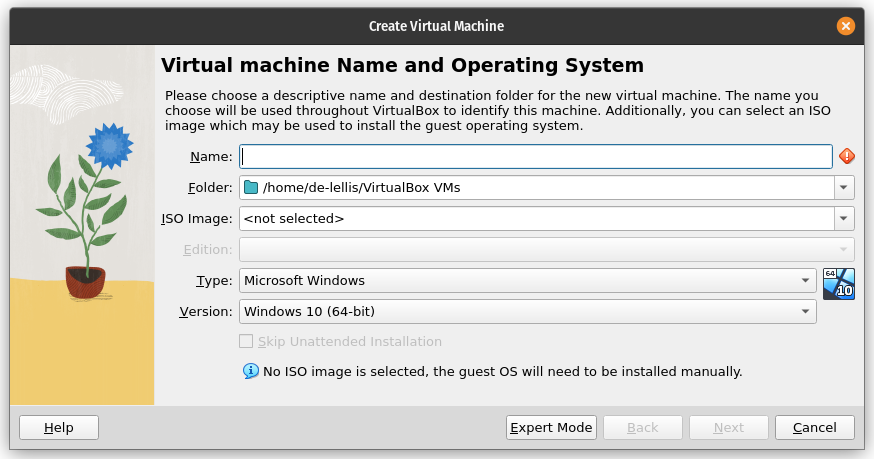
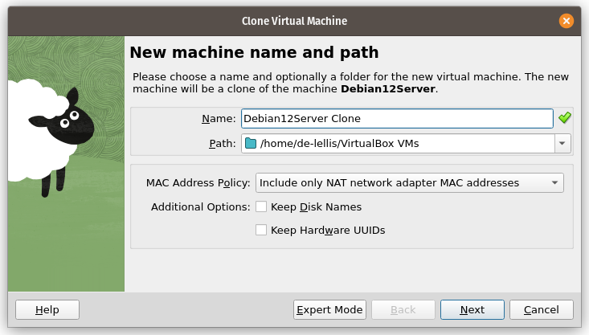
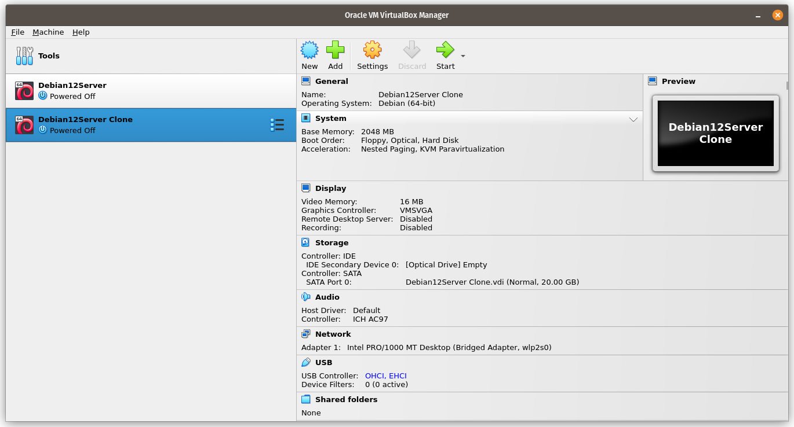
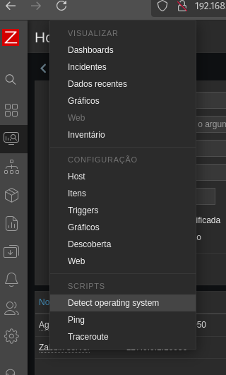

# Configuração de ambiente Zabbix
Repositório dedicado à configuração de um ambiente Zabbix para um projeto de alta disponibilidade da matéria de Sistemas Distribuídos.

<!-- 
## Instalação da máquina virtual

### Download da ISO
Antes de realizar a instalação da máquina virtual, é preciso selecionar e realizar o download do sistema operacional desejado. Para esse projeto, a distribuição Linux Debian 12 foi escolhida. Sua ISO está disponível no site [debian.org](https://www.debian.org/download) e pode ser baixada ao acessar a página e clicar no link abaixo:


### Criação da máquina no VirtualBox
Durante esse processo de informação irei criar uma máquina destinada à execução do serviço Zabbix. No entanto, caso sua intenção seja de criar uma instalação padrão para replicar e instalar outros serviços em máquinas virtuais clonadas, talvez seja interessante nomear a máquina e criar usuário de forma genérica. Ao abrir o VirtualBox, a seguinte tela irá ser carregada:


Para criar uma nova máquina virtual, é preciso clicar no botão "New", disposto no menu horizontal com ícones. Após clicar nessa opção, a seguinte tela será exibida:


Nessa tela, é preciso inserir informações como o nome da máquina virtual, Debian12Server no meu caso, e o caminho para ISO, que como foi baixada recentemente, se encontra na pasta Downloads:


OBS.: caso a opção "Skip Unattended Installation" não seja selecionada, a instalação será feita de maneira automática, instalando a versão desktop da distribuição com os pacotes padrões e o GNOME como 

Ao clicar em "Next", a próxima tela irá ser disposta, requisitando informações do sistema. Como essa será uma instalação mínima, as opções padrões foram mantidas (2GB RAM e 1 CPU):


Por fim são requisitadas as informações de disco do sistema, que também foram mantidas as opções padrão, criando um novo disco virtual de 20GB:


Ao informar todas as informações necessárias, uma tela de confirmação é exibida, dando-nos a oportunidade de revisar os parâmetros fornecidos:


Ao clicar em "Finish", a máquina virtual será criada, sendo disposta na tela inicial do VirtualBox:


### Instalação do Debian 12 Server
Embora a máquina virtual tenha sido criada, sua instalação ainda não foi realizada. Para dar início à instalação, é preciso iniciar a máquina virtual clicando no botão "Start":


Ao clicar no botão "Start", a máquina virtual será inicializada e a tela inicial de instalação do Debian será exibida. Por opção pessoal, optei pela opção "Install", porém a opção "Graphical Install" possue os mesmos passos descritos abaixo. Para selecionar a opção desejada, é preciso mover a seleção utilizando as setas direcionais do teclado e selecionando através da tecla "Enter":


A primeira tela do processo de instalação é a de seleção de idioma, que julguei português como a opção mais adequada para esse projeto:


É possível buscar por um item na lista de valores exibida. Para fazer isso, é preciso apenas digitar em seu teclado o nome da opção. No meu caso, digitei a letra "p" e desci até a opção "Português (Brazil)":


Como consequência, o sistema já reconhece o Brasil como uma possível localidade. Selecionei portanto "Brasil" como opção quando perguntado qual minha localização:


A próxima informação que deverá ser fornecida no processo de instalação é o layout do teclado utilizado pela máquina virtual. Caso tenha selecionado as opções acima, a opção de "Português Brasileiro" já será sugerida:


Após informar essas informações iniciais, outros componentes serão carregados pelo instalador para realizar os próximos passos:


A primeira informação mais relevante para o processo de instalação será o "hostname" da máquina, ou seja, qual será o nome do máquina, que poderá ser utilizado para identificar a própria na rede. Levando em consideração, optei por nomear minha máquina virtual de "zabbixm" ("Zabbix Machine" ou "Zabbix Máquina") para essa instalação:

OBS.: talvez seja interessante em sua situação nomear essa máquina de forma genérica, a fim de cloná-la e instalar outros serviços, sem a necessidade de passar pelo processo de criação da máquina virtual novamente.

A seguir, é exibida a tela de criação do super usuário para a máquina virtual. No entanto, optei por não criar um super usuário nessa instalação, que é mínima, fazendo com que o usuário comum criado nos prompts a seguir se torne o único usuário do sistema e facilite a nossa vida:


Em seguida é pedido o domínio de rede a que a máquina pertence. Para essa instalação, esse campo pode ser mantido da forma que nos é exibida. Realizando a instalação em meu computador pessoal, mantive ele em branco:


Então nos é pedido para informar a que estado pertencemos, a fim de configurar o relógio da máquina com o fuso horário correto. Tendo informado que estamos no Brasil, a lista de valores com todos os estados é mostrado, nos bastando selecionar "Rio Grande do Norte" no nosso caso:


Finalmente é pedido para criarmos o nosso usuário padrão, que nesse caso dei o nome de Admin, uma vez que será o usuário que logaremos para realizar a configuração do serviço Zabbix posteriormente:


O seu nome de usuário por sua vez será "zadmin" (Zabbix Admin), uma vez que o nome de usuário "admin" é reservado:


A senha selecionada por mim para essa instalação foi "2020":

OBS.: sinta-se livre para alterar os campos acima.

Com os usuários configurados, finalmente nos é permitido realizar o particionamento do disco a fim de iniciar factualmente o processo de instalação do sistema. Optei por utilizar a opção de particionamento assistido:


Por questões de boas práticas, como a possível necessidade de redimensionamento do tamanho de disco, optei por selecionar uma opção de particionamento com LVM (Logical Volume Management):


Em seguida, selecionei o disco virtual em que a máquina deveria ser instalada:


Como a instalação precisaria de apenas um usuário e da instalação de poucos pacotes para a configuração do serviço, optei pela opção que utiliza apenas uma ```/home``` em uma partição separada, sem separar ```/var``` e ```/tmp```:


Aparecerá uma tela de confirmação, em que você deverá selecionar a opção "Sim":


Por fim, aparecerá um campo requisitando o tamanho do grupo de volumes que será gerado a partir do particionamento. A sugestão inicial é baseada no disco virtual gerado no momento de criação da máquina virtual, então selecionei a opção "Continuar" sem alterar nada:


Será então mostrado um sumário do particionamento, informando os volumes que serão criados e seus detalhes. É preciso então finalizar o processo de particionamento selecionando a opção correspondente:


Aparecerá uma tela de confirmação, em que a opção "Sim" deverá ser selecionada para realizar as mudanças no disco e dar início aos passos finais da instalação:


Será iniciada então a instalação básica do sistema:


Aparecerá uma tela perguntando se deseja-se instalar pacotes adicionais por meio de mídias externas, porém não é relevante para nossa instalação, então seleciona-se a opção "Não":


Então é gerada a tela de configuração do gerenciador de pacotes, que de início solicita que informemos o páis do espelho (mirror) do repositório Debian: 


E então nos é solicitado qual o espelho desejado, que na minha instalação foi a opção padrão, "deb.debian.org":


Nos é perguntado se existe um proxy HTTP que desejamos cadastrar. Para nosso cenário, deixaremos esse campo em branco e daremos continuidade à instalação por meio do botão "Continuar":


O repositório enfim é configurado:


Também é dado início à instalação de softwares padrão:


O instalador então nos pergunta se desejamos fazer parte de uma "pesquisa de popularidade", que prontamente deve-se responder que "Não":


Então nos é mostrado uma tela para seleção de softwares que desejamos incluir na nossa máquina. Por padrão, a interface gráfica GNOME e o ambiente de trabalho Debian estão selecionados. No entanto, para nossa instalação, fora o servidor SSH, nenhum desses pacotes é relevante, que posteriormente será utilizado:

OBS.: essa tela precisa de muita atenção, uma vez que para desselecionar uma opção, é utilizado a tecla Espaço. A tecla Enter, por sua vez, é responsável por confirmar a seleção de pacotes desejados e dar início à instalação desses pacotes. Atente-se a esse detalhe para não instalar pacotes indesejados!

Por fim será instalado o GRUB em nosso sistema:


Será perguntado se desejamos instalar o GRUB no disco primário da máquina, que optei por responder com "Sim":


Será necessário informar qual o dispositivo em que o GRUB deverá ser instalado:


Então a instalação do bootloader será finalizada:


Em seguida, a instalação também será finalizada:


Ao fim da instalação, a seguinte tela será exibida, fazendo com que a máquina virtual seja reiniciada:


Entraremos então no processo de boot e a tela de seleção do GRUB será mostrada:


Após selecionar o sistema Debian, nossa máquina por nome "zabbixm" será inicializada:


Será então possível fazer uso dessa máquina para configurar nosso servidor e disponibilizar o serviço Zabbix.


OBS.: esse será o momento ideal para clonar a máquina sem nenhum serviço instalado. A partir daqui dará se início à instalação do serviço Zabbix.
 -->

## Instalação e Configuração do serviço Zabbix
Abaixo estarão descritos os passos necessários para configurar e disponibilizar o Zabbix na rede.

### Alterando a máquina virtual para modo bridge
O primeiro passo para conectar-se à máquina virtual via SSH será alterar a configuração de rede da máquina virtual para modo brigde. Isso pode ser feito acessando o menu de configurações da máquina virtual desejada:


Após isso a tela abaixo será exibida, onde deve-se selecionar a opção "Network" ou rede:


Por padrão a opção "NAT" estará selecionada, no entanto deve-se selecionar o modo "Bridge Adapter" deve ser selecionado para que um IP seja atribuído a nossa máquina virtual e ela seja acessada por outras máquinas na rede. Além disso, para que o IP seja atribuído é preciso marcar a opção "Allow All" no campo "Promiscuous Mode":


### Utilizando SSH para conectar à máquina virtual
Os comandos utilizados no tutorial abaixo podem ser inseridos dentro do terminal da própria máquina virtual, porém, por questões de praticidade, como a possibilidade de copiar e colar comandos, optei por rodar os comandos do meu terminal nativo utilizando SSH. Para fazer isso, primeiramente é preciso verificar se o SSH está instalado na máquina virtual. Isso pode ser feito a partir do comando abaixo:

```sh
/etc/init.d/ssh status
```

Caso tenha selecionado as mesmas opções que esse tutorial, a saída esperada deve ser a seguinte:


É interessante também verificar se o SSH está instalado em sua máquina, uma vez que algumas distribuições não o possuem instalado nativamente. Essa verificação pode ser feita utilizando o comando anterior. Caso não esteja instalado em nenhuma das situações acima, o serviço pode ser instalado da seguinte maneira:

```sh
sudo apt-get update # atualizando apt-get
sudo apt-get install openssh-server # instalação via apt-get
/etc/init.d/ssh status # verificando status após instalação
```

Após isso, é possível realizar a conexão SSH a partir do comando abaixo:
```sh
ssh usuario@<ip.da.minha.maquina>
```

A saída esperada caso a conexão seja bem sucedida será a seguinte:
```sh
zadmin@169.254.8.52's password: 
Linux zabbixm 6.1.0-30-amd64 #1 SMP PREEMPT_DYNAMIC Debian 6.1.124-1 (2025-01-12) x86_64

The programs included with the Debian GNU/Linux system are free software;
the exact distribution terms for each program are described in the
individual files in /usr/share/doc/*/copyright.

Debian GNU/Linux comes with ABSOLUTELY NO WARRANTY, to the extent
[...]

```

<!-- ### Utilizando SSH para conectar à máquina virtual

Os comandos utilizados no tutorial abaixo podem ser inseridos dentro do terminal da própria máquina virtual, porém, por questões de praticidade, como a possibilidade de copiar e colar comandos, optei por rodar os comandos do meu terminal nativo utilizando SSH. Para fazer isso, primeiramente é preciso verificar se o SSH está instalado na máquina virtual. Isso pode ser feito a partir do comando abaixo:

```sh
/etc/init.d/ssh status
```

Caso tenha selecionado as mesmas opções que esse tutorial, a saída esperada deve ser a seguinte:


É interessante também verificar se o SSH está instalado em sua máquina, uma vez que algumas distribuições não o possuem instalado nativamente. Essa verificação pode ser feita utilizando o comando anterior. Caso não esteja instalado em nenhuma das situações acima, o serviço pode ser instalado da seguinte maneira:

```sh
sudo apt-get update # atualizando apt-get
sudo apt-get install openssh-server # instalação via apt-get
/etc/init.d/ssh status # verificando status após instalação
```

Após isso, é preciso cadastrar no VirtualBox o encaminhamento de porta responsável por estabelecer a conexão de um convidado à máquina virtual. 


Após isso, é possível realizar a conexão SSH a partir do comando abaixo:
```sh
ssh -p 2222 zadmin@localhost
```

A saída esperada caso a conexão seja bem sucedida será a seguinte:
```sh
The authenticity of host '[localhost]:2222 ([127.0.0.1]:2222)' can't be established.
ED25519 key fingerprint is SHA256:Jbw2dV2+tJ7bdl4pFoPSO0qRPHgvE1sOp98X+lo2MOc.
This key is not known by any other names
Are you sure you want to continue connecting (yes/no/[fingerprint])? yes
Warning: Permanently added '[localhost]:2222' (ED25519) to the list of known hosts.
zadmin@localhost's password: 
Linux zabbixm 6.1.0-30-amd64 #1 SMP PREEMPT_DYNAMIC Debian 6.1.124-1 (2025-01-12) x86_64
[...]
```
 -->

### Instalação do Zabbix
Primeiramente é preciso realizar o download do pacote instalador do Zabbix:
```sh
wget https://repo.zabbix.com/zabbix/7.0/debian/pool/main/z/zabbix-release/zabbix-release_7.0-2+debian$(cut -d"." -f1 /etc/debian_version)_all.deb
```

Depois é realizada a instalação por meio do comando "dpkg" e o parâmetro "-i" e a seguinte sequência de comandos:
```sh
dpkg -i zabbix-release_7.0-2+debian12_all.deb
apt update
apt -y install zabbix-server-pgsql php8.2-pgsql zabbix-frontend-php zabbix-apache-conf zabbix-sql-scripts zabbix-asudo 
```
OBS.: os comandos desta seção foram executados como superusuário.

<!--
apt -y install zabbix-server-pgsql php8.2-pgsql zabbix-server-mysql zabbix-frontend-php zabbix-apache-conf zabbix-sql-scripts zabbix-asudo 
OBS.: nesse comando estão sendo instalados pacotes para pgsql e mysql, idealmente deve-se optar por um. -->

### Configuração do banco de dados usando PostgreSQL
Assumindo que os comandos anteriores tenham sido rodados selecionando pacotes referentes ao PostgreSQL, pode-se iniciar a criação e configuração do banco de dados. Criando banco de dados PostgreSQL:
```sh
apt install postgresql -y
su postgres
```

Agora, deve-se criar um usuário "zabbix" no banco de dados Postgres. Vai pedir para criar uma senha para o user. Lembrar dela, pois vai ser usada posteriormente:
```sh
createuser --pwprompt zabbix
createdb -0 zabbix zabbix
su
zcat /usr/share/zabbix-sql-scripts/postgresql/server.sql.gz | sudo u zabbix psql zabbix
```

Configurando o banco de dados para o servidor zabbix:
```sh
nano /etc/zabbix/zabbix_server.conf
```
Importante: no lugar de "password", deve ser colocada aquela senha que foi criada para o usuario "zabbix". Alterar a Linha DBPassword. Ex:
```sh
DBPassword=password
```

Reiniciar os serviços do zabbix e apache para aplicação das configurações. Em seguida, comando para iniciar o serviço automaticamente quando o servidor ligar:
```sh
systemctl restart zabbix-server zabbix-agent apache2
systemctl enable zabbix-server zabbix-agent apache2
```

<!-- ### Configuração do banco de dados usando MySQL
Instalação do MariaDB:
```sh
sudo apt install software-properties-common -y
sudo apt install curl -y
curl -LsS -O https://downloads.mariadb.com/MariaDB/mariadb_repo_setup
sudo bash mariadb_repo_setup --mariadb-server-version=10.11
sudo apt update
sudo apt install mariadb-common mariadb-server mariadb-client -y
```
Verificar se a instalação foi bem sucedida e se o serviço está em execução:
```sh
/etc/init.d/mariadb status
```

Alterar senha do usuário root do banco de dados MySQL:
```sh
sudo mysql_secure_installation
```

Respostas que devem ser fornecidas:
```sh
Enter current password for root (enter for none): Apertar Enter
Switch to unix_socket authentication [Y/n] Y
Change the root password? [Y/n] Y
New password: 2020
Re-enter new password: 2020
Remove anonymous users? [Y/n]: Y
Disallow root login remotely? [Y/n]: Y
Remove test database and access to it? [Y/n]:  Y
Reload privilege tables now? [Y/n]:  Y
```

Criando banco de dados Zabbis via MySQL:
```sh
sudo mysql -uroot -p'2020' -e "create database zabbix character set utf8mb4 collate utf8mb4_bin;"
sudo mysql -uroot -p'2020' -e "create user 'zabbix'@'localhost' identified by '123';"
sudo mysql -uroot -p'2020' -e "grant all privileges on zabbix.* to zabbix@localhost identified by '123';"
```

Verificar se o banco de dados foi criado corretamente. Primeiramente acessamos a ferramenta mysql do terminal através do comando abaixo, acessando por meio do usuário Zabbix:
```sh
mysql -u zabbix -p
```
Caso a conexão seja bem sucedidade, a saída a seguir será esperada:
```sh
Enter password: 
Welcome to the MariaDB monitor.  Commands end with ; or \g.
Your MariaDB connection id is 46
Server version: 10.11.10-MariaDB-deb12 mariadb.org binary distribution
[...]
MariaDB [(none)]>
```

A query abaixo pode ser executada para exibir os bancos de dados existentes:
```sh
MariaDB [(none)]> SHOW DATABASES;
+--------------------+
| Database           |
+--------------------+
| information_schema |
| zabbix             |
+--------------------+
2 rows in set (0,002 sec)
```

Carregar o schema inicial disponibilizado pelo pacote Zabbix:
```sh
sudo zcat /usr/share/zabbix-sql-scripts/mysql/server.sql.gz | mysql --default-character-set=utf8mb4 -uzabbix -p'123' zabbix
```

Editar arquivo de configuração do servidor:
```sh
sudo nano /etc/zabbix/zabbix_server.conf
```

Deverá ser adicionada a linha abaixo em qualquer lugar do arquivo:
```sh
DBPassword=123
```

Para salvar, Crtl+X, y e Enter.

Reiniciando serviços:
```sh
systemctl restart zabbix-server zabbix-agent apache2
systemctl enable zabbix-server zabbix-agent apache2
```

Após isso, será possível acessar o front-end do Zabbix a partir de um navegador web e do endereço IP da máquina virtual. No meu caso, sendo 169.254.8.52 o IP da minha máquina virtual, ao acessar o link [169.254.8.52/zabbix](http://169.254.8.52/zabbix/setup.php), a página abaixo é exibida:
 -->

### Configuração do Web Front-End
Após completar os passos das etapas anteriores, é possível dar início à configuração do front-end da ferramenta. No meu caso, selecionei a opção de idioma "PT-BR" e cliquei em "Próximo passo":


Uma tela conferindo os pré-requisitos foi apresentada, mostrando que todos os requisitos estavam satisfeitos:


Em seguida uma tela requisitando informações do banco de dados foi mostrada. No entanto, caso você tenha seguido os passos descritos nessa documentação e criado o banco de dados e usuário "zabbix", só será necessário informar a senha do usuário:


Será então exibida uma tela de configurações pedindo o nome do servidor (chamei de zabbixm), o fuso horário e o tema do front-end desejado:


Após confirmar as configurações, uma tela de sumário será apresentada:


Ao clicar em próximo passo, a última tela será exibida e a instalação estará completa:


Ao finalizar a instalação o usuário é levado até a tela de login do sistema. O usuário padrão para o front-end é "Admin" e possui a senha "zabbix":


Realizando o login, o usuário terá acesso à tela inicial de monitoramento da ferramenta Zabbix:


<!-- ## Configurando servidor Zabbix em cluster para prover alta disponibilidade

### Clonando a máquina virtual
Para a configuração visando alta disponibilidade, será necessária a utilização de dois servidor com Zabbix instalado, uma servindo como servidor ativo do serviço e outra como nó, que deverá ser ativado caso o primeiro servidor não esteja disponível. Para criação da segunda máquina virtual, pode-se realizar o processo de instalação da máquina virtual e configuração do serviço novamente ou, alternativamente, pode-se realizar a clonagem da primeira máquina, uma vez que ela já possui o serviço configurado e executado satisfatóriamente até esse ponto.

Nessa documentação optarei pela segundalt texta opção, realizando a clonagem da máquina virtual dentro do VirtualBox. Isso pode ser feito clicando com o botão direito e na opção "Clone" na máquina virtual desejada na tela inicial do VirtualBox. Ao fazer isso, a seguinte tela será mostrada:


As opções selecionadas por padrão já são de nosso interesse, então pode-se clicar na opção "Next" e continuar o processo de clonagem:


O VirtualBox então questionará se o clone desejado deve ser um "Clone Completo", em que haverá uma cópia exatada feita, inclusive do disco virtual. Essa é a opção que percisamos, então daremos fim ao processo de clonagem ao clicar em "Finish". Aparecerá no menu inicial uma barra de progresso mostrando o estado no processo:


Finalmente teremos acesso à segunda máquina virtual, que assim como a primeira, estará disponível para acesso na página inicial do VirtualBox:


### Configuração do servidor nó
Após isso, pode-se dar início às duas máquinas virtuais, uma vez que será necessário verificar as informações da primeira para cadastrar a segunda como seu nó:


É preciso então verificar o IP das máquinas antes de realizar o cadastro:


No meu caso, a máquina 1 tem IP 192.168.0.108 e seu clone tem IP 192.168.0.116. Por questão de praticidade, acessarei ambas as máquinas via terminal do meu computador pessoal. Com as duas máquinas em execução e suas informações resgatadas, é possível iniciar o processo de configuração do servidor nó.

Primeiramente configurarei a máquina principal, atribuindo um nome ao seu nó e o seu endereço IP correspondente. Para isso, o arquivo o arquivo ```/etc/zabbix/zabbix_server.conf``` deverá ser alterado:
```sh
sudo nano /etc/zabbix/zabbix_server.conf
```

deve-se então informar o IP da máquina (```192.168.0.108``` no meu caso) e dar um nome para o nó (nomeei de "zbx-node1"). Dentro do arquivo de configuração, em qualquer posição, deve-se adicionar as duas seguintes linhas:
```sh
HANodeName=zbx-node1
NodeAddres=192.168.0.108
```

De maneira análoga, no clone, o arquivo ```/etc/zabbix/zabbix_server.conf``` também deverá ser alterado:
```sh
sudo nano /etc/zabbix/zabbix_server.conf
```

Mantendo o padrão, da máquina principal, a máquina clone, que tem IP ```192.168.0.116```, terá como nome de seu nó "zbx-node2". Dentro do arquivo de configuração, em qualquer posição, deve-se adicionar as duas seguintes linhas:
```sh
HANodeName=zbx-node2
NodeAddres=192.168.0.116
```

Essa é a primeira configuração que deverá ser feita em prol da alta disponibilidade. Em seguida, deve-se configurar a máquina principal para que suas informações, como o banco de dados, seja acessível para a máquina secundária. O primeiro passo deverá ser a criação de um usuário para a máquina secundária. Para isso, pode-se criar um usuário por meio da ferramenta linha de comando do MySQL a partir do comando abaixo:
```sh
mysql -uroot -p'2020' -e "create user 'zabbix2'@'192.168.0.116' identified by 'zabbix';"
mysql -uroot -p'2020' -e "grant all privileges on zabbix.* to zabbix2@192.168.0.116 identified by 'zabbix';"
```

Sendo o valor após o parâmetro ```-p``` a senha do super usuário, o valor logo após o comando ```create user``` o nome do usuário (zabbix2) e após o @, o endereço IP da máquina que deseja acessar o banco de dados por meio desse usuário, no meu caso, 192.168.0.116. Por fim, ```identified by``` deve ser seguido pela senha do usuário, que por algum motivo eu defini como "zabbix".

Uma peculiaridade do MariaDB é que seu ```bind-address``` está configurado por padrão para o IP 127.0.0.1, impedindo que conexões externas sejam realizadas. dessa forma, precisamos também alterar essa configuração do banco de dados da nossa máquina principal, a fim de deixá-lo acessível para a máquina secundária. Dessa forma, na máquina principal, a partir do comando abaixo será possível acessar e alterar o arquivo de configuração do MariaDB:
```sh
nano /etc/mysql/mariadb.conf.d/50-server.cnf
```

Dentro do arquivo de configuração, altere a linha a seguir (utilize o comando Crtl+W para pesquisar), inserindo o endereço IP da máquina principal:
```sh
bind-address            = 127.0.0.1
```

Para a seguinte linha:
```sh
bind-address            = 192.168.0.108
```

Na máquina secundária, voltando para a configuração do arquivo ```/etc/zabbix/zabbix_server.conf```, deve-se informar as informações que acabamos de definir na máquina principal. Ou seja, deve-se alterar os campos condizentes ao banco de dados para que seja possível realizar a conexão:
```sh
/etc/zabbix/zabbix_server.conf
```

Busque pelas linhas abaixo e forneça os valores condizentes:
```sh
DBHost=192.168.0.108
DBName=zabbix
DBUser=zabbix2
DBPassword=zabbix
```

Realizando esses passos, bastará configurar o arquivo ```/etc/zabbix/zabbix_agentd.conf``` da máquina secundária, fornecendo informações sobre o servidor a que ela deve se conectar:
```sh
nano /etc/zabbix/zabbix_agentd.conf 
```

Busque pela linha "Server" utilizando o comando Crtl+W, e achará a seguinte informação:
```sh
Server=127.0.0.1
```

Você deverá então mudar para a seguinte linha:
```sh
Server=127.0.0.1,192.168.0.108
```

A mesma coisa deverá ser feita na linha "ServerActive":
```sh
ServerActive=127.0.0.1,192.168.0.108
```

Por fim, deve-se nomear a máquina secundária preenchendo a linha "Hostname". Optei por nomeá-lo por "Zabbix node server":
```sh
Hostname=Zabbix node server
``` -->

E assim finaliza-se a configuração dentro do servidor hospedando o serviço Zabbix, os próximos passos devem ser feitos na interface gráfica web.

## Conectar um host ao Zabbix
Para conectar um host no Zabbix e iniciar seu monitoramento, é preciso instalar o Zabbix Agent no servidor que deseja-se monitorar.

Primeiramente, é preciso realizar o acesso ao servidor desejado:
```sh
ssh usuario@ip.do.servidor.desejado
```

### Instalação do Zabbix Agent diretamente no terminal
Caso a máquina em que se deseja instalar o Zabbix Agent possua acesso a internet, sua instalação pode ser realizada por meio do comando abaixo:
```sh
sudo apt install zabbix-agent
```

### Instalação do Zabbix Agent via .deb
O Zabbix disponibiliza pacotes instaláveis dos seus serviços. Sendo assim, pode-se previamente baixar um pacote do Zabbix Agent em [zabbix.com](https://www.zabbix.com).

Esse pacote foi disponibilizado nesse repositório em formato [.deb](./zabbix-release_latest_7.2+ubuntu22.04_all.deb).

Portanto, caso não seja possível instalar o pacote com o método anterior na máquina desejada, pode-se copiar o pacote via rede local usando o comando `scp`:
```sh
scp caminho_para_.deb/zabbix-release_latest_7.2+ubuntu22.04_all.deb usuario_destino@ip_destino:/home/destino
```

Com o instalador em mãos, o serviço Zabbix Agent pode ser instado da seguinte forma:
```sh
dpkg -i zabbix-release_latest_7.2+ubuntu22.04_all.deb
sudo apt update
sudo apt install zabbix-agent
```

### Configuração na máquina alvo
Verificar instalação:
```sh
systemctl status zabbix-agent
```

Saída esperada:
```sh
● zabbix-agent.service - Zabbix Agent
     Loaded: loaded (/lib/systemd/system/zabbix-agent.service; enabled; preset: enabled)
     Active: active (running) since Sun 2025-03-09 19:38:02 -03; 59s ago
       Docs: man:zabbix_agentd
   Main PID: 1480 (zabbix_agentd)
      Tasks: 6 (limit: 2293)
     Memory: 2.7M
        CPU: 39ms
     CGroup: /system.slice/zabbix-agent.service
             ├─1480 /usr/sbin/zabbix_agentd --foreground
             ├─1481 "/usr/sbin/zabbix_agentd: collector [idle 1 sec]"
             ├─1482 "/usr/sbin/zabbix_agentd: listener #1 [waiting for connection]"
             ├─1483 "/usr/sbin/zabbix_agentd: listener #2 [waiting for connection]"
             ├─1484 "/usr/sbin/zabbix_agentd: listener #3 [waiting for connection]"
             └─1485 "/usr/sbin/zabbix_agentd: active checks #1 [idle 1 sec]"

```

Caso a inicialização automática não esteja ativada (`enabled`):
```sh
systemctl enable zabbix-server
```

Primeiramente, deve-se fornecer informações sobre o servidor que realizará o monitoramento, dentro da máquina alvo. Edite o arquivo abaixo:
```sh
sudo nano /etc/zabbix/zabbix_agentd.conf 
```

Busque pela linha "Server" utilizando o comando Crtl+W, e achará a seguinte informação:
```sh
Server=127.0.0.1
```

Você deverá então mudar para a seguinte linha:
```sh
Server=127.0.0.1,<ip.maquina.de.monitoramento>
```

A mesma coisa deverá ser feita na linha "ServerActive":
```sh
ServerActive=127.0.0.1,<ip.maquina.de.monitoramento>
```

Por fim, opcionalmente, pode-se nomear a máquina secundária preenchendo a linha "Hostname":
```sh
Hostname=<Nome_do_serviço_da_máquina_alvo>
```

### Configuração no Web Front-End
Após realizar os passos anteriores na máquina alvo, deve acessar a interface Web do Zabbix e ir nas opções Monitoramento > Hosts. A tela abaixo será exibida:


No topo direito da tela existe o botão "Criar host". Ao clicar no botão, o formulário será gerado:


As informações deverão ser preenchidas. Caso seja um servidor Linux a ser monitorado, o template "Linux by Zabbix agent". Já o grupo de hosts deverá ser "Linux servers". Por fim, deve-se clicar em Adicionar abaixo de "Interfaces" e adicionar o IP do servidor alvo. A porta padrão deverá ser mantida. Exemplo de preenchimento:


OBS.: O Nome do host precisa ser idêntico ao fornecido na configuração da máquina alvo!

Ao clicar em "Adicionar", um novo host será cadastrado na interface Web e terá seus recursos monitorados!


De princípio a tag "ZBX" na coluna "Disponibilidade" do nome do host estará cinza e vazada. Mas ao recarregar, a tag ficará verde novamente:


Ao clicar no nome do host, o menu flutuante será aberto:


Se clicarmos na opção "Dashboards", seremos levados para a página abaixo:


A partir dessa tela pode-se navegar e visualizar dados e gráficos sobre os recursos monitorados do host!

### Configuração de monitoramento de um serviço Web (como Moodle)
Com o Zabbix Agent, também é possível realizar o monitoramento de um serviço Web, como o Moodle. Para o nosso cenário, isso pode ser realizado por meio do template Apache via Zabbix Server. A configuração é idêntica à apresentada anteriormente, a única diferença é na tela de configuração, onde deve-se selecionar o template "Apache by Zabbix agent":


OBS.: é preciso que o web service e o serviço Apache estejam instalados no servidor monitorado para que os dados sejam retornados.

Ao abrir o dashboard do host, veremos que os recursos monitorados são diferentes, uma vez que o template é voltado para a coleta de dados relevantes para um serviço web, como quantidade de requisições por segundo, a carga no Workers do serviço e o estado desses Workers:


## Criação do mapa de hosts
Após a configuração dos hosts que deverão ser monitorados pelo Zabbix, eles deverão ser adicionados ao "Mapa" chamado "Local Network". Esse mapa consiste de um diagrama, que deve ser manualmente editado, adicionando os elementos presentes na rede local. Para acessar a página de mapas, deve-se navegar por Monitoramento > Mapas. A página abaixo deve ser aberta:


Para editar o mapa, é preciso clicar no botão que se encontra no canto superior direito da página, "Editar mapa". Ao clicar no botão, a página será levemente alterada, nos dando a oportunidade de modificar o mapa atual (Local Network):


Uma barra horizontal contendo o seguinte conteúdo irá aparecer:

"Elemento do mapa: Adicionar/Remover Forma: Adicionar/Remover [...]"

### Adicionar um Host
Para adicionar um elemento, é preciso clicar na opção "Adicionar" após "Elemento do mapa". Ao clicar nessa opção, uma máquina será adicionada ao mapa:


Ao clicar na máquina, o seguinte menu será exibido:


deve-se clicar no menu de seleção "Tipo" e selecionar na opção Host:


No campo de texto "Host", deve-se digitar o nome do host desejado e selecioná-lo:


Altere o texto que será exibido no mapa no campo de texto "Texto". Se desejar, altere o ícone do elemento no menu de seleção "Ícones" e no campo "padrão":


Para salvar as alterações no mapa, basta clicar na opção "Atualizar" abaixo do menu horizontal com as opções comentadas.

### Adicionar um link (conexão) entre elementos
Para adicionar um link, a lógica segue a mesma da adição de um elemento. No entanto, é preciso selecionar quais elementos devem ser ligados. Ou seja, deve-se selecionar 2 elementos distintos e clicar na opção "Adicionar" na frente de "Link". Para selecionar dois elementos, pode-se segurar o `LShift` e arrastar o cursor do mouse, criando uma área de seleção:


Ao soltar a seleção, ambos os elementos estarão selecionados:


Por fim, apenas resta clicar na opção de adicionar link. Uma linha verde será traçada entre os elementos:


Para salvar as alterações no mapa, basta clicar na opção "Atualizar" abaixo do menu horizontal com as opções comentadas.

## Realizando testes de cenários de falha
### Falha no Zabbix Server
Um teste de falha que pode ser realizado no Zabbix Server é o de parar o serviço e observar o comportamento da interface Web:
```sh
systemctl stop zabbix-server
```

Quando o serviço para de rodar, a interface Web deverá indicar que o serviço não está rodando na tela inicial:


### Falha no Zabbix Agent
Outro teste que pode ser realizado é a parada do serviço Zabbix Agent. Para simular esse cenário, na máquina monitorada, deve-se parar o serviço:
```sh
systemctl stop zabbix-agent
```

Esse cenário deve ser apontado pela interface Web também, informando a indisponibilidade de um host e alterando o status do host selecionado para indisponível:


### Uso Elevado de CPU no Servidor Zabbix
Para verificar se o uso elevado de CPU no servidor Zabbix interfere na execução do serviço pode-se realizar um teste de estresse. Para isso pode-se realizar por meio do "stress-ng", pacote que deve ser instalado com o comando abaixo:
```sh
sudo apt install stress-ng
```

Para realizar o teste de estresse no servidor, executar o comando abaixo:
```sh
stress-ng --cpu 8 --timeout 60
```

Esse teste não interfere na execução do serviço e nem da interface Web. Esse consumo elevado da CPU irá ser apontado no gráfico de uso de CPU na aba de monitoramento do host:


### Uso Elevado de CPU no agente Zabbix
Para realizar o teste de estresse no agente, executar o comando abaixo:
```sh
stress-ng --cpu 8 --timeout 60
```

Esse cenário deve apresentar um pico no uso da CPU no gráfico correspondente na aba de monitoramento do host:


### Falha de Espaço em Disco
Nós pode-se realizar um teste de estresse no armazenamento do servidor para verificar seu comportamento quando não há espaço suficiente para escrita:
```sh
dd if=/dev/zero of=/tmp/filldisk bs=1M count=100000
```

Esse cenário deverá causar um disco cheio, que pode ser observado também na aba de monitoramento, dessa vez do servidor Zabbix:


Um problema foi identificado durante esse teste. Embora a execução da interface web tenha continuado com êxito, o seguinte erro foi disposto no dashboard da página inicial:


Como esperado, nessa situação, em que o servidor hospedando o serviço teve sua /tmp completamente preenchida, ele não será capaz de realizar operações que necessitam de arquivos temporários. No entanto, isso não impede o monitoramento de recursos dos hosts cadastrados.

Para remover o espaço preenchido pelo comando acima, utilizar o comando abaixo:
```sh
rm -f /tmp/filldisk
```

Após esses testes, nós poderemos verificar no gráfico de carga, quando o serviço precisou lidar com a maior carga e verificar seu comportamento nesse espaço de tempo verificando os demais dados:


# Configuração do ambiente Zabbix no projeto de alta disponibilidade
A configuração do ambiente Zabbix no projeto de alta disponibilidade foi realizada por meio do pacote Zabbix Agent, que foi instalado e configurado em todos os servidores a serem monitorados, com o processo documentado acima. O servidor contendo o Zabbix possui o endereço de IP 10.49.6.96, informação utilizada para a configuração do Agent, conforme está documentado na seção "Configuração na máquina alvo". Os seguintes servidores foram adicionados como hosts no ambiente de monitoramento do projeto:

| Endereço IP   | Serviço  | Usuário   | Senha     |
|---------------|----------|-----------|-----------|
| 10.49.10.10   | HProxy   | debian12  | debian12  |
| 10.49.10.11   | Moodle 1 | debian12  | debian12  |
| 10.49.10.12   | Moodle 2 | debian12  | debian12  |
| 10.49.10.80   | DRDB 1   | aluno     | ifrn.cn   |
| 10.49.10.81   | DRDB 2   | aluno     | ifrn.cn   |
| 10.49.6.108   | MariaDB 1| aluno     | ifrn.cn   |
| 10.49.6.109   | MariaDB 2| aluno     | ifrn.cn   |

Após a configuração, a lista de hosts monitorados pelo Zabbix apresentava os seguintes elementos:


Com a adição de todos os servidores do projeto, foi possível a criação de um diagrama que representasse a estrutura monitorada, inclusive exibindo o estado e incidentes atuais das máquinas:


OBS.: É possível observar incidentes abaixo do nome da máquina, como por exemplo, os incidentes relacionadas ao serviço Moodle, que são explicados pelo momento em que o registro foi realizado (16:17, como mostra a imagem), em que o grupo responsável estava passando por momentos de debugging para identificar erros no setup do serviço. 

<!-- 
# Avaliação
| Informação | Valor                                                                                    |
|------------|------------------------------------------------------------------------------------------|
| Tema       | Alta Disponibilidade de Monitoramento de Recursos com Zabbix                             |
| Objetivo   | Configurar um ambiente Zabbix para garantir a continuidade do monitoramento de recursos. |

## Descrição das Tarefas
| Tarefa                                                                                                    | Status |
|-----------------------------------------------------------------------------------------------------------|--------|
| Instalar e configurar o Zabbix em um servidor.                                                            | Ok     |
| Monitorar recursos básicos de ambos os servidores Zabbix, incluindo CPU, memória e disco, como validação. | Ok     |
| Documentar o processo de configuração e simular cenários de falhas para testar a redundância.             | Ok     |
| Fornecer painéis demonstrativos no Zabbix com a visão dos recursos monitorados.                           | Ok     |

## Critérios de Avaliação
| Critério                                                                                                  | Status       |
|-----------------------------------------------------------------------------------------------------------|--------------|
| O serviço Zabbix está instalado, configurado e pode ser reiniciado sem erros;                             | Ok           |
| O serviço Zabbix pode ser acessado pela Interface gráfica do browser;                                     | Ok           |
| O Zabbix pode ser acessado diretamente por qualquer máquina do laboratório na faixa de IPs: 10.49.0.0/16; | Ok           |
| O Zabbix vai utilizar qual protocolo ou métodos para obter as informações dos hosts;                      | Zabbix Agent |
| Criar uma tela com o diagrama das máquinas da atividade.                                                  | Ok           |
 -->