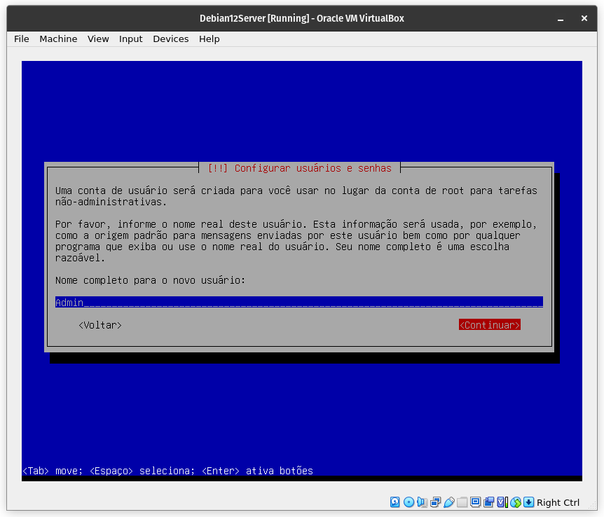
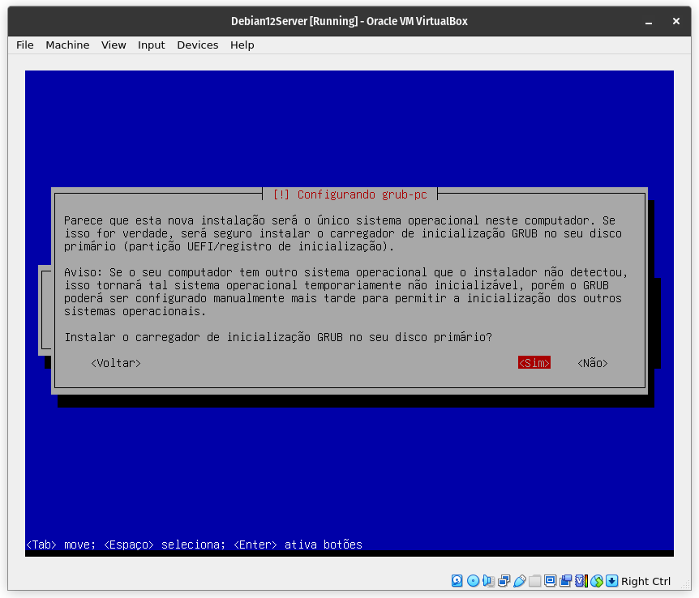

# Configuração de ambiente Zabbix
Repositório dedicado à configuração de um ambiente Zabbix para um projeto de alta disponibilidade da matéria de Sistemas Distribuídos.

## Instalação da máquina virtual

### Download da ISO
Antes de realizar a instalação da máquina virtual, é preciso selecionar e realizar o download do sistema operacional desejado. Para esse projeto, a distribuição Linux Debian 12 foi escolhida. Sua ISO está disponível no site [debian.org](https://www.debian.org/download) e pode ser baixada ao acessar a página e clicar no link abaixo:


### Criação da máquina no VirtualBox
Ao abrir o VirtualBox, a seguinte tela irá ser carregada:


Para criar uma nova máquina virtual, é preciso clicar no botão "New", disposto no menu horizontal com ícones. Após clicar nessa opção, a seguinte tela será exibida:


Nessa tela, é preciso inserir informações como o nome da máquina virtual, Debian12Server no meu caso, e o caminho para ISO, que como foi baixada recentemente, se encontra na pasta Downloads:


OBS.: caso a opção "Skip Unattended Installation" não seja selecionada, a instalação será feita de maneira automática, instalando a versão desktop da distribuição com os pacotes padrões e o GNOME como 

Ao clicar em "Next", a próxima tela irá ser disposta, requisitando informações do sistema. Como essa será uma instalação mínima, as opções padrões foram mantidas (2GB RAM e 1 CPU):


Por fim são requisitadas as informações de disco do sistema, que também foram mantidas as opções padrão, criando um novo disco virtual de 20GB:


Ao informar todas as informações necessárias, uma tela de confirmação é exibida, dando-nos a oportunidade de revisar os parâmetros fornecidos:


Ao clicar em "Finish", a máquina virtual será criada, sendo disposta na tela inicial do VirtualBox:


### Instalação do Debian 12 Server
Embora a máquina virtual tenha sido criada, sua instalação ainda não foi realizada. Para dar início à instalação, é preciso iniciar a máquina virtual clicando no botão "Start":


Ao clicar no botão "Start", a máquina virtual será inicializada e a tela inicial de instalação do Debian será exibida:








## Configuração do Zabbix
Abaixo estarão descritos os passos necessários para configurar e disponibilizar o Zabbix na rede.

### Alterando a máquina virtual para modo bridge
O primeiro passo para conectar-se à máquina virtual via SSH será alterar a configuração de rede da máquina virtual para modo brigde. Isso pode ser feito acessando o menu de configurações da máquina virtual desejada:


Após isso a tela abaixo será exibida, onde deve-se selecionar a opção "Network" ou rede:


Por padrão a opção "NAT" estará selecionada, no entanto devemos selecionar o modo "Bridge Adapter" deve ser selecionado para que um IP seja atribuído a nossa máquina virtual e ela seja acessada por outras máquinas na rede. Além disso, para que o IP seja atribuído é preciso marcar a opção "Allow All" no campo "Promiscuous Mode":


### Utilizando SSH para conectar à máquina virtual
Os comandos utilizados no tutorial abaixo podem ser inseridos dentro do terminal da própria máquina virtual, porém, por questões de praticidade, como a possibilidade de copiar e colar comandos, optei por rodar os comandos do meu terminal nativo utilizando SSH. Para fazer isso, primeiramente é preciso verificar se o SSH está instalado na máquina virtual. Isso pode ser feito a partir do comando abaixo:

```sh
/etc/init.d/ssh status
```

Caso tenha selecionado as mesmas opções que esse tutorial, a saída esperada deve ser a seguinte:


É interessante também verificar se o SSH está instalado em sua máquina, uma vez que algumas distribuições não o possuem instalado nativamente. Essa verificação pode ser feita utilizando o comando anterior. Caso não esteja instalado em nenhuma das situações acima, o serviço pode ser instalado da seguinte maneira:

```sh
sudo apt-get update # atualizando apt-get
sudo apt-get install openssh-server # instalação via apt-get
/etc/init.d/ssh status # verificando status após instalação
```

Após isso, é possível realizar a conexão SSH a partir do comando abaixo:
```sh
ssh zadmin@169.254.8.52 # sendo 169.254.8.52 o IP atribuído à minha máquina
```

A saída esperada caso a conexão seja bem sucedida será a seguinte:
```sh
zadmin@169.254.8.52's password: 
Linux zabbixm 6.1.0-30-amd64 #1 SMP PREEMPT_DYNAMIC Debian 6.1.124-1 (2025-01-12) x86_64

The programs included with the Debian GNU/Linux system are free software;
the exact distribution terms for each program are described in the
individual files in /usr/share/doc/*/copyright.

Debian GNU/Linux comes with ABSOLUTELY NO WARRANTY, to the extent
[...]

```
<!-- ### Utilizando SSH para conectar à máquina virtual
Os comandos utilizados no tutorial abaixo podem ser inseridos dentro do terminal da própria máquina virtual, porém, por questões de praticidade, como a possibilidade de copiar e colar comandos, optei por rodar os comandos do meu terminal nativo utilizando SSH. Para fazer isso, primeiramente é preciso verificar se o SSH está instalado na máquina virtual. Isso pode ser feito a partir do comando abaixo:

```sh
/etc/init.d/ssh status
```

Caso tenha selecionado as mesmas opções que esse tutorial, a saída esperada deve ser a seguinte:


É interessante também verificar se o SSH está instalado em sua máquina, uma vez que algumas distribuições não o possuem instalado nativamente. Essa verificação pode ser feita utilizando o comando anterior. Caso não esteja instalado em nenhuma das situações acima, o serviço pode ser instalado da seguinte maneira:

```sh
sudo apt-get update # atualizando apt-get
sudo apt-get install openssh-server # instalação via apt-get
/etc/init.d/ssh status # verificando status após instalação
```

Após isso, é preciso cadastrar no VirtualBox o encaminhamento de porta responsável por estabelecer a conexão de um convidado à máquina virtual. 


Após isso, é possível realizar a conexão SSH a partir do comando abaixo:
```sh
ssh -p 2222 zadmin@localhost
```

A saída esperada caso a conexão seja bem sucedida será a seguinte:
```sh
The authenticity of host '[localhost]:2222 ([127.0.0.1]:2222)' can't be established.
ED25519 key fingerprint is SHA256:Jbw2dV2+tJ7bdl4pFoPSO0qRPHgvE1sOp98X+lo2MOc.
This key is not known by any other names
Are you sure you want to continue connecting (yes/no/[fingerprint])? yes
Warning: Permanently added '[localhost]:2222' (ED25519) to the list of known hosts.
zadmin@localhost's password: 
Linux zabbixm 6.1.0-30-amd64 #1 SMP PREEMPT_DYNAMIC Debian 6.1.124-1 (2025-01-12) x86_64
[...]
```
 -->
### Instalação do Zabbix
Primeiramente é preciso realizar o download do pacote instalador do Zabbix:
```sh
wget https://repo.zabbix.com/zabbix/7.0/debian/pool/main/z/zabbix-release/zabbix-release_7.0-2+debian$(cut -d"." -f1 /etc/debian_version)_all.deb
```

Depois é realizada a instalação por meio do comando "dpkg" e o parâmetro "-i" e a seguinte sequência de comandos:
```sh
dpkg -i zabbix-release_7.0-2+debian12_all.deb
sudo apt update
sudo apt -y install zabbix-server-pgsql php8.2-pgsql zabbix-server-mysql zabbix-frontend-php zabbix-apache-conf zabbix-sql-scripts zabbix-asudo 
```

OBS.: nesse comando estão sendo instalados pacotes para pgsql e mysql, idealmente deve-se optar por um.

<!-- Instalando o servidor, frontend e agente Zabbix:
```sh
apt install  zabbix-frontend-php  zabbix-apache-conf zabbix-sql-scripts zabbix-agent
``` -->

### Configuração do banco de dados usando PostgreSQL
Assumindo que os comandos anteriores tenham sido rodados selecionando pacotes referentes ao PostgreSQL, pode-se iniciar a criação e configuração do banco de dados. Criando banco de dados PostgreSQL:
```sh
apt install postgresql -y
su postgres
```

Agora, devemos criar um usuário "zabbix" no banco de dados Postgres. Vai pedir para criar uma senha para o user. Lembrar dela, pois vai ser usada posteriormente:
```sh
createuser --pwprompt zabbix
createdb -0 zabbix zabbix
su
zcat /usr/share/zabbix-sql-scripts/postgresql/server.sql.gz | sudo u zabbix psql zabbix
```

Configurando o banco de dados para o servidor zabbix:
```sh
nano /etc/zabbix/zabbix_server.conf
```
Importante: no lugar de "password", deve ser colocada aquela senha que foi criada para o usuario "zabbix". Alterar a Linha DBPassword. Ex:
```sh
DBPassword=password
```

Reiniciar os serviços do zabbix e apache para aplicação das configurações. Em seguida, comando para iniciar o serviço automaticamente quando o servidor ligar:
```sh
systemctl restart zabbix-server zabbix-agent apache2
systemctl enable zabbix-server zabbix-agent apache2
```

### Configuração do banco de dados usando MySQL
Instalação do MariaDB:
```sh
sudo apt install software-properties-common -y
sudo apt install curl -y
curl -LsS -O https://downloads.mariadb.com/MariaDB/mariadb_repo_setup
sudo bash mariadb_repo_setup --mariadb-server-version=10.11
sudo apt update
sudo apt install mariadb-common mariadb-server mariadb-client -y
```
Verificar se a instalação foi bem sucedida e se o serviço está em execução:
```sh
/etc/init.d/mariadb status
```

Alterar senha do usuário root do banco de dados MySQL:
```sh
sudo mysql_secure_installation
```

Respostas que devem ser fornecidas:
```sh
Enter current password for root (enter for none): Apertar Enter
Switch to unix_socket authentication [Y/n] Y
Change the root password? [Y/n] Y
New password: 2020
Re-enter new password: 2020
Remove anonymous users? [Y/n]: Y
Disallow root login remotely? [Y/n]: Y
Remove test database and access to it? [Y/n]:  Y
Reload privilege tables now? [Y/n]:  Y
```

Criando banco de dados Zabbis via MySQL:
```sh
sudo mysql -uroot -p'2020' -e "create database zabbix character set utf8mb4 collate utf8mb4_bin;"
sudo mysql -uroot -p'2020' -e "create user 'zabbix'@'localhost' identified by '123';"
sudo mysql -uroot -p'2020' -e "grant all privileges on zabbix.* to zabbix@localhost identified by '123';"
```

Verificar se o banco de dados foi criado corretamente. Primeiramente acessamos a ferramenta mysql do terminal através do comando abaixo, acessando por meio do usuário Zabbix:
```sh
mysql -u zabbix -p
```
Caso a conexão seja bem sucedidade, a saída a seguir será esperada:
```sh
Enter password: 
Welcome to the MariaDB monitor.  Commands end with ; or \g.
Your MariaDB connection id is 46
Server version: 10.11.10-MariaDB-deb12 mariadb.org binary distribution
[...]
MariaDB [(none)]>
```

A query abaixo pode ser executada para exibir os bancos de dados existentes:
```sh
MariaDB [(none)]> SHOW DATABASES;
+--------------------+
| Database           |
+--------------------+
| information_schema |
| zabbix             |
+--------------------+
2 rows in set (0,002 sec)
```

Carregar o schema inicial disponibilizado pelo pacote Zabbix:
```sh
sudo zcat /usr/share/zabbix-sql-scripts/mysql/server.sql.gz | mysql --default-character-set=utf8mb4 -uzabbix -p'123' zabbix
```

Editar arquivo de configuração do servidor:
```sh
sudo nano /etc/zabbix/zabbix_server.conf
```

Deverá ser adicionada a linha abaixo em qualquer lugar do arquivo:
```sh
DBPassword=123
```

Para salvar, Crtl+X, y e Enter.

Reiniciando serviços:
```sh
systemctl restart zabbix-server zabbix-agent apache2
systemctl enable zabbix-server zabbix-agent apache2
```

Após isso, será possível acessar o front-end do Zabbix a partir de um navegador web e do endereço IP da máquina virtual. No meu caso, sendo 169.254.8.52 o IP da minha máquina virtual, ao acessar o link [169.254.8.52/zabbix](http://169.254.8.52/zabbix/setup.php), a página abaixo é exibida:


### Configuração do Web Front-End
Após completar os passos das etapas anteriores, é possível dar início à configuração do front-end da ferramenta. No meu caso, selecionei a opção de idioma "PT-BR" e cliquei em "Próximo passo":


Uma tela conferindo os pré-requisitos foi apresentada, mostrando que todos os requisitos estavam satisfeitos:


Em seguida uma tela requisitando informações do banco de dados foi mostrada. No entanto, caso você tenha seguido os passos descritos nessa documentação e criado o banco de dados e usuário "zabbix", só será necessário informar a senha do usuário:


Será então exibida uma tela de configurações pedindo o nome do servidor (chamei de zabbixm), o fuso horário e o tema do front-end desejado:


Após confirmar as configurações, uma tela de sumário será apresentada:


Ao clicar em próximo passo, a última tela será exibida e a instalação estará completa:


Ao finalizar a instalação o usuário é levado até a tela de login do sistema. O usuário padrão para o front-end é "Admin" e possui a senha "zabbix":


Realizando o login, o usuário terá acesso à tela inicial de monitoramento da ferramenta Zabbix:


## Configurando servidor Zabbix em cluster para prover alta disponibilidade