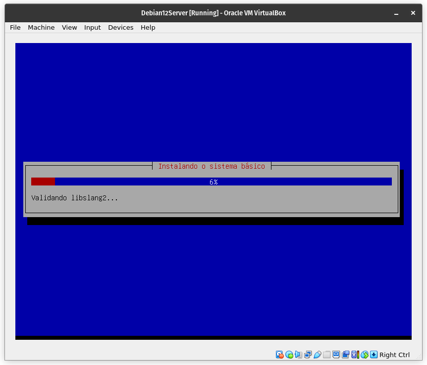
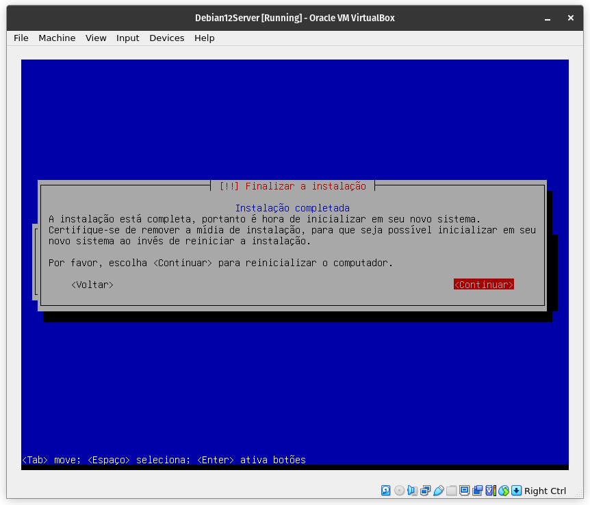
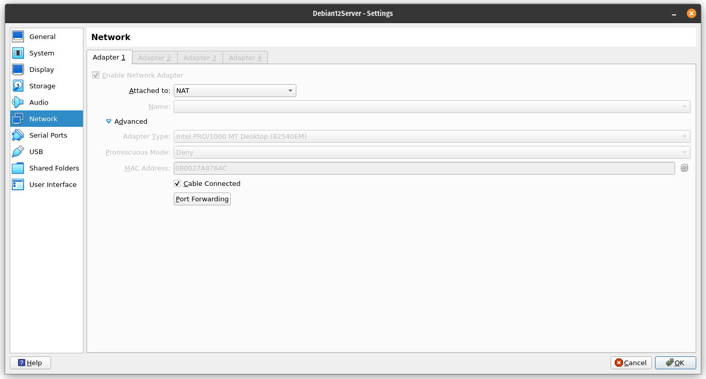

# Configuração de ambiente Zabbix
Repositório dedicado à configuração de um ambiente Zabbix para um projeto de alta disponibilidade da matéria de Sistemas Distribuídos.

## Instalação da máquina virtual

### Download da ISO
Antes de realizar a instalação da máquina virtual, é preciso selecionar e realizar o download do sistema operacional desejado. Para esse projeto, a distribuição Linux Debian 12 foi escolhida. Sua ISO está disponível no site [debian.org](https://www.debian.org/download) e pode ser baixada ao acessar a página e clicar no link abaixo:


### Criação da máquina no VirtualBox
Ao abrir o VirtualBox, a seguinte tela irá ser carregada:


Para criar uma nova máquina virtual, é preciso clicar no botão "New", disposto no menu horizontal com ícones. Após clicar nessa opção, a seguinte tela será exibida:


Nessa tela, é preciso inserir informações como o nome da máquina virtual, Debian12Server no meu caso, e o caminho para ISO, que como foi baixada recentemente, se encontra na pasta Downloads:


OBS.: caso a opção "Skip Unattended Installation" não seja selecionada, a instalação será feita de maneira automática, instalando a versão desktop da distribuição com os pacotes padrões e o GNOME como 

Ao clicar em "Next", a próxima tela irá ser disposta, requisitando informações do sistema. Como essa será uma instalação mínima, as opções padrões foram mantidas (2GB RAM e 1 CPU):


Por fim são requisitadas as informações de disco do sistema, que também foram mantidas as opções padrão, criando um novo disco virtual de 20GB:


Ao informar todas as informações necessárias, uma tela de confirmação é exibida, dando-nos a oportunidade de revisar os parâmetros fornecidos:


Ao clicar em "Finish", a máquina virtual será criada, sendo disposta na tela inicial do VirtualBox:


### Instalação do Debian 12 Server
Embora a máquina virtual tenha sido criada, sua instalação ainda não foi realizada. Para dar início à instalação, é preciso iniciar a máquina virtual clicando no botão "Start":


Ao clicar no botão "Start", a máquina virtual será inicializada e a tela inicial de instalação do Debian será exibida:








## Configuração do Zabbix
Abaixo estarão descritos os passos necessários para configurar e disponibilizar o Zabbix na rede.

### Utilizando SSH para conectar à máquina virtual
Os comandos utilizados no tutorial abaixo podem ser inseridos dentro do terminal da própria máquina virtual, porém, por questões de praticidade, como a possibilidade de copiar e colar comandos, optei por rodar os comandos do meu terminal nativo utilizando SSH. Para fazer isso, primeiramente é preciso verificar se o SSH está instalado na máquina virtual. Isso pode ser feito a partir do comando abaixo:

```sh
/etc/init.d/ssh status
```

Caso tenha selecionado as mesmas opções que esse tutorial, a saída esperada deve ser a seguinte:


É interessante também verificar se o SSH está instalado em sua máquina, uma vez que algumas distribuições não o possuem instalado nativamente. Essa verificação pode ser feita utilizando o comando anterior. Caso não esteja instalado em nenhuma das situações acima, o serviço pode ser instalado da seguinte maneira:

```sh
sudo apt-get update # atualizando apt-get
sudo apt-get install openssh-server # instalação via apt-get
/etc/init.d/ssh status # verificando status após instalação
```

Após isso, é preciso cadastrar no VirtualBox o encaminhamento de porta responsável por estabelecer a conexão de um convidado à máquina virtual. 




Após isso, é possível realizar a conexão SSH a partir do comando abaixo:
```sh
ssh -p 2222 zadmin@localhost
```

A saída esperada caso a conexão seja bem sucedida será a seguinte:
```sh
The authenticity of host '[localhost]:2222 ([127.0.0.1]:2222)' can't be established.
ED25519 key fingerprint is SHA256:Jbw2dV2+tJ7bdl4pFoPSO0qRPHgvE1sOp98X+lo2MOc.
This key is not known by any other names
Are you sure you want to continue connecting (yes/no/[fingerprint])? yes
Warning: Permanently added '[localhost]:2222' (ED25519) to the list of known hosts.
zadmin@localhost's password: 
Linux zabbixm 6.1.0-30-amd64 #1 SMP PREEMPT_DYNAMIC Debian 6.1.124-1 (2025-01-12) x86_64
[...]
```

### Instalação usando PostgreSQL
...

### Instalação usando MySQL
...